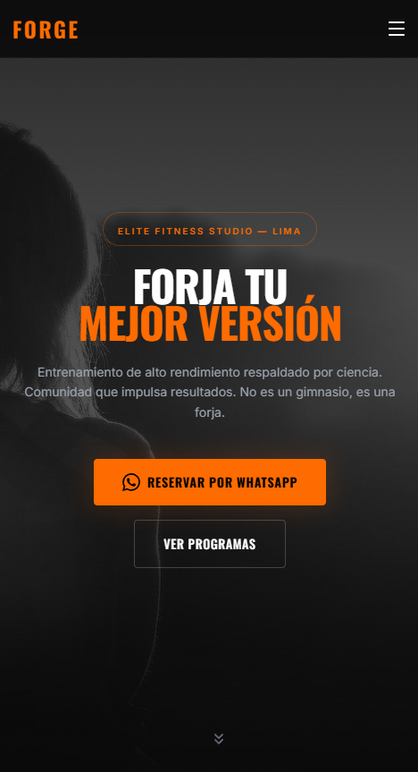
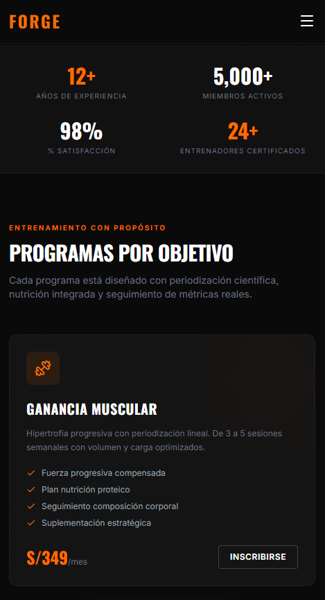
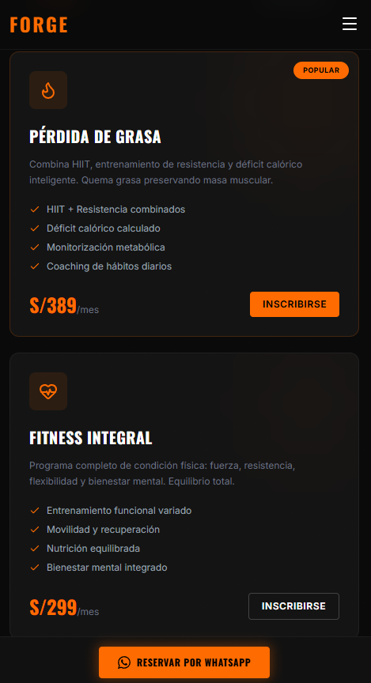
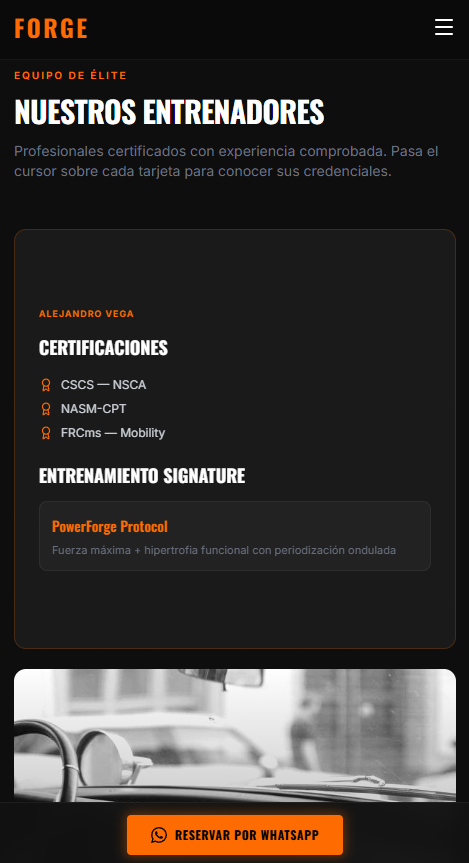

# FORGE — Elite Fitness Studio Lima

Landing page de una sola página (single-page) para **FORGE**, un estudio de fitness de alto rendimiento en Lima. El sitio está construido en HTML puro con Tailwind CSS (vía CDN) y JavaScript vanilla, sin necesidad de build ni dependencias instaladas.

  

## ✨ Características

- **Diseño responsive** — adaptado para móvil, tablet y desktop.
- **Hero con video de fondo** en blanco y negro con overlay degradado.
- **Barra de estadísticas animada** con contadores incrementales al hacer scroll (`IntersectionObserver`).
- **Sección de programas** con tarjetas destacadas.
- **Tarjetas de entrenadores con efecto flip 3D** (frente/reverso) al pasar el mouse o al tocar en móvil.
- **Carrusel de historias de miembros** con soporte de arrastre (drag) por mouse y touch, autoplay y navegación por puntos/flechas.
- **Formulario de reserva integrado con WhatsApp** — al enviarlo, arma un mensaje pre-formateado y abre WhatsApp con los datos del interesado.
- **Menú móvil** a pantalla completa con animación.
- **Barra inferior sticky (CTA)** que aparece al salir de la sección hero.
- **Efecto de grano/textura** sutil sobre toda la interfaz.
- **SEO y redes sociales** — meta tags completos (Open Graph, Twitter Cards, favicon en SVG/PNG, `theme-color`, etc.).

## 📸 Capturas de pantalla

Vista en modo responsivo (móvil):

<p align="center">
  
  
  
  
  
</p>

> Guarda tus 5 capturas dentro de la carpeta `images/` con los nombres `preview1.png` a `preview5.png` (o ajusta la extensión/rutas en este README si usas otro formato, por ejemplo `.jpg`).

## 🛠️ Tecnologías

| Tecnología | Uso |
|---|---|
| [Tailwind CSS](https://tailwindcss.com/) (CDN) | Estilos y sistema de diseño utility-first |
| [Lucide Icons](https://lucide.dev/) | Iconografía |
| [Google Fonts](https://fonts.google.com/) — Inter & Oswald | Tipografía |
| JavaScript Vanilla | Interactividad (carrusel, contadores, menú, formulario, etc.) |

No requiere Node.js, npm ni ningún proceso de compilación: es un único archivo `index.html` autocontenido.

## 📂 Estructura del proyecto

```
.
├── index.html          # Página completa (HTML + CSS + JS embebidos)
└── images/
    ├── preview1.png     # Captura responsiva 1
    ├── preview2.png     # Captura responsiva 2
    ├── preview3.png     # Captura responsiva 3
    ├── preview4.png     # Captura responsiva 4
    └── preview5.png     # Captura responsiva 5
```

## 🚀 Cómo usarlo

1. Clona el repositorio:
   ```bash
   git clone https://github.com/tu-usuario/forge-fitness.git
   cd forge-fitness
   ```
2. Abre `index.html` directamente en tu navegador, o sírvelo con un servidor local, por ejemplo:
   ```bash
   npx serve .
   ```
   o
   ```bash
   python3 -m http.server 8000
   ```
3. Visita `http://localhost:8000` (o la ruta que indique tu servidor).

No hay pasos de instalación de dependencias: Tailwind, Lucide y las fuentes se cargan desde CDN.

## ⚙️ Configuración

### Número de WhatsApp

El formulario de reserva envía los datos a un número de WhatsApp configurado en el script:

```js
const WHATSAPP_NUMBER = '51999888777';
```

Actualiza esta constante (dentro de `index.html`) con el número real del negocio, en formato internacional sin símbolos (código de país + número).

### Meta tags / SEO

Los tags `og:url`, `og:image`, `twitter:image`, `description`, etc. están en el `<head>` y deben actualizarse con el dominio e imágenes definitivas antes de publicar a producción.

### Contenido dinámico

- **Estadísticas**: se editan en los atributos `data-count` de la sección de stats.
- **Programas, entrenadores e historias**: son bloques HTML repetidos dentro de sus respectivas secciones (`#programs`, `#trainers`, `#stories`); se pueden duplicar o editar directamente.

## 📱 Responsive

El sitio usa el sistema de breakpoints de Tailwind (`sm`, `md`, `lg`) para adaptar tipografía, grillas y el menú de navegación (menú hamburguesa en móvil, barra horizontal en desktop).

## 📄 Licencia

Este proyecto se distribuye bajo la licencia MIT. Siéntete libre de adaptarlo y reutilizarlo.

---

Hecho con 🧡 para FORGE Fitness Studio — Lima, Perú.
